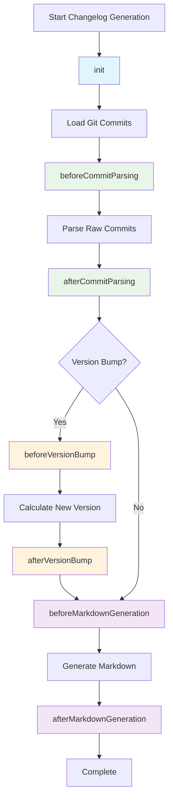

# Changelogen Plugin System

The changelogen plugin system allows you to extend and customize the changelog generation process through a comprehensive hook-based architecture.

## Overview

Plugins can modify various aspects of the changelog generation:

- **Commit Processing**: Enrich commits with additional metadata
- **Markdown Generation**: Customize the output format and content
- **Version Management**: Influence version bumping logic
- **Release Workflow**: Add custom release steps

## Configuration

Plugins are configured in your changelog configuration file:

```javascript
// changelog.config.js
export default {
  plugins: {
    // NPM package plugin
    "changelogen-jira-plugin": {
      baseUrl: "https://company.atlassian.net",
      projectKeys: ["ABC", "DEF"],
    },

    // Local plugin
    "./plugins/custom-plugin.js": {
      customOption: "value",
    },

    // Disable a plugin
    "some-plugin": false,
  },
};
```

## Plugin Interface

A plugin must implement the `ChangelogPlugin` interface:

```typescript
interface ChangelogPlugin {
  name: string;
  version?: string;

  // Lifecycle hooks (all optional)
  init?(context: PluginContext): Promise<void> | void;
  beforeCommitParsing?(
    commits: RawGitCommit[],
    config: ResolvedChangelogConfig
  ): Promise<RawGitCommit[]> | RawGitCommit[];
  afterCommitParsing?(
    commits: GitCommit[],
    config: ResolvedChangelogConfig
  ): Promise<GitCommit[]> | GitCommit[];
  beforeMarkdownGeneration?(
    commits: GitCommit[],
    config: ResolvedChangelogConfig
  ): Promise<GitCommit[]> | GitCommit[];
  afterMarkdownGeneration?(
    markdown: string,
    commits: GitCommit[],
    config: ResolvedChangelogConfig
  ): Promise<string> | string;
  beforeVersionBump?(
    commits: GitCommit[],
    config: ResolvedChangelogConfig
  ): Promise<void> | void;
  afterVersionBump?(
    newVersion: string,
    config: ResolvedChangelogConfig
  ): Promise<void> | void;
}
```

## Plugin Lifecycle

Plugins are executed in the following order during changelog generation:



### Hook Details

1. **init** - Plugin initialization
2. **beforeCommitParsing** - Before parsing raw git commits
3. **afterCommitParsing** - After parsing commits into structured data
4. **beforeVersionBump** - Before calculating new version
5. **afterVersionBump** - After version has been bumped
6. **beforeMarkdownGeneration** - Before generating markdown
7. **afterMarkdownGeneration** - After markdown has been generated

## Creating a Plugin

### Basic Plugin Structure

```typescript
import type { ChangelogPlugin, PluginContext } from "changelogen";
import type { GitCommit } from "changelogen";

export class MyPlugin implements ChangelogPlugin {
  name = "my-plugin";
  version = "1.0.0";

  private config: MyPluginConfig;
  private logger: any;

  constructor(config: MyPluginConfig) {
    this.config = config;
  }

  init(context: PluginContext): void {
    this.logger = context.logger;
    this.logger.info("MyPlugin initialized");
  }

  afterCommitParsing(commits: GitCommit[]): GitCommit[] {
    // Modify commits here
    return commits;
  }
}

export default MyPlugin;
```

### Plugin Configuration

```typescript
interface MyPluginConfig {
  option1: string;
  option2?: boolean;
}
```

## Example: Jira Integration Plugin

Here's a complete example of a Jira integration plugin:

```typescript
import type { ChangelogPlugin, PluginContext } from "changelogen";
import type { GitCommit, Reference } from "changelogen";

export interface JiraPluginConfig {
  baseUrl: string;
  projectKeys: string[];
  ticketPattern?: RegExp;
}

export class JiraPlugin implements ChangelogPlugin {
  name = "jira-plugin";
  version = "1.0.0";

  private config: JiraPluginConfig;
  private logger: any;

  constructor(config: JiraPluginConfig) {
    this.config = {
      ticketPattern: /([A-Z]+-\d+)/g,
      ...config,
    };
  }

  init(context: PluginContext): void {
    this.logger = context.logger;
    this.logger.debug(
      `Initialized Jira plugin with base URL: ${this.config.baseUrl}`
    );
  }

  afterCommitParsing(commits: GitCommit[]): GitCommit[] {
    return commits.map((commit) => {
      const jiraTickets = this.extractJiraTickets(
        commit.message + " " + commit.body
      );

      if (jiraTickets.length > 0) {
        // Add Jira ticket references
        const jiraReferences: Reference[] = jiraTickets.map((ticket) => ({
          type: "jira-ticket",
          value: ticket,
          url: `${this.config.baseUrl}/browse/${ticket}`,
        }));

        commit.references.push(...jiraReferences);
      }

      return commit;
    });
  }

  private extractJiraTickets(text: string): string[] {
    const matches = text.match(this.config.ticketPattern) || [];
    return matches.filter((ticket: string) =>
      this.config.projectKeys.some((key) => ticket.startsWith(key + "-"))
    );
  }
}

export default JiraPlugin;
```

## Plugin Distribution

### NPM Packages

For public distribution, publish your plugin as an NPM package:

```bash
npm publish my-changelogen-plugin
```

Naming conventions:

- Official plugins: `@changelogen/plugin-name`
- Community plugins: `changelogen-plugin-name`

### Local Plugins

For project-specific plugins, create them locally:

```
project/
├── plugins/
│   └── custom-plugin.js
└── changelog.config.js
```

## Best Practices

1. **Error Handling**: Always handle errors gracefully and provide meaningful error messages
2. **Logging**: Use the provided logger for consistent output
3. **Performance**: Avoid blocking operations in hooks
4. **Type Safety**: Use TypeScript for better development experience
5. **Testing**: Write tests for your plugin functionality
6. **Documentation**: Document your plugin's configuration options and behavior

## Debugging Plugins

Enable debug logging to see plugin execution:

```bash
DEBUG=changelogen:plugins changelogen
```

## Plugin Registry

A curated list of community plugins:

- [`changelogen-jira-plugin`](https://github.com/mmeester/changelogen-jira-plugin) - Jira ticket integration

## Contributing

To contribute a plugin to the official registry:

1. Follow the naming convention
2. Include comprehensive tests
3. Provide clear documentation
4. Submit a pull request to the main repository
